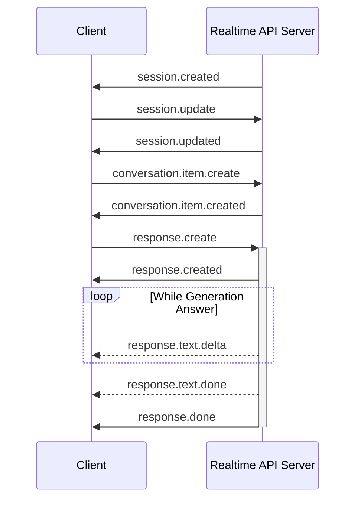

# Azure Open AI Realtime API

# How the Realtime API works
The Realtime API works using Web Sockets to connect the client and the server.
The communication is `event based`. The client request something by specifying the event type in the request.
And the server response with the event indication the executed action or current state of the the process.

## Client events
List of the available events.

| Event                         | Description                                                                                           |
| ----------------------------- | ----------------------------------------------------------------------------------------------------- |
| conversation.item.create      | - Add new item to the conversation   - Like message, function calling, function calling response  |
| conversation.item.delete      | Remove item from the conversation                                                                     |
| conversation.item.truncate    | Truncate previous assistant message's audio                                                           |
| input_audio_buffer.append     | Append audio bytes to the audio input buffer                                                          |
| input_audio_buffer.clear      | Clear input audio buffer                                                                              |
| input_audio_buffer.commit     | Commit the user input audio buffer                                                                    |
| response.cancel               | cancel in-progress response                                                                           |
| response.create               | Reques to create a response by model inference                                                        |
| session.update                | Update the session default configuration                                                              |

[Microsoft Reference](https://learn.microsoft.com/en-us/azure/ai-services/openai/realtime-audio-reference#client-events)

## Server events
List of the available events.

| Event                                                   | Description                                                                       |
| ------------------------------------------------------- | --------------------------------------------------------------------------------- |
| conversation.created                                    | - Returned after the session is created   - One conversation per session      |
| conversation.item.created                               | Returned when a conversation item is created                                      |
| conversation.item.deleted                               | Returned when the client deletes an item                                          |
| conversation.item.input_audio_transcription.completed   | Resull of the audio transcription for the audio input                             |
| conversation.item.input_audio_transcription.failed      | Returned when the transcription failed                                            |
| conversation.item.truncated                             | Returned when the client truncates an item                                        |
| error                                                   | Returned when an error ocurred (client or server)                                 |
| input_audio_buffer.cleared                              | Returned when the client clears the input audio buffer                            |
| input_audio_buffer.committed                            | Returned when the client commits the input audio buffer                           |
| input_audio_buffer.speech_started                       | Returned in `server_vad` mode when a speech is detected in the input buffer       |
| input_audio_buffer.speech_stopped                       | Returned in `server_vad` mode when the server detectes that the end of the speech |
| rate_limits.updated                                     | - Emitted at the beginning of a response   - Indicates the updated rate limit |
| response.audio.delta                                    | Returned when the generated audio is updated                                      |
| response.audio.done                                     | Returned when the generated audio is done                                         |
| response.audio_transcript.delta                         | Returned when the generated transcript is updated                                 |
| response.audio_transcript.done                          | Returned when the generated transcript is done                                    |
| response.content_part.added                             | Returned when a new content part is added to the assistant message                |
| response.content_part.done                              | Returned when a content part is done streaming                                    |
| response.created                                        | Returned when a new response is created. Response is `in_progress` state          |
| response.done                                           | Returned when a response is done streaming                                        |
| response.function_call_arguments.delta                  | Returned when the generated function call arguments are updated                   |
| response.function_call_arguments.done                   | Returned when the generated function call arguments are done streaming            |
| response.output_item.added                              | Returned when a new item is created during response generation                    |
| response.output_item.done                               | Returned when a response item done streaming                                      |
| response.text.delta                                     | Returned when the generated text is updated                                       |
| response.text.done                                      | Returned when the generated text is done streaming                                |
| session.created                                         | First event return from the server  when a new connection is stablished           |
| session.updated                                         | Returned when a session has been updated by the client                            |

# Sequence diagram for a simple app
The following sequence diagram is for simple text in text out application.

